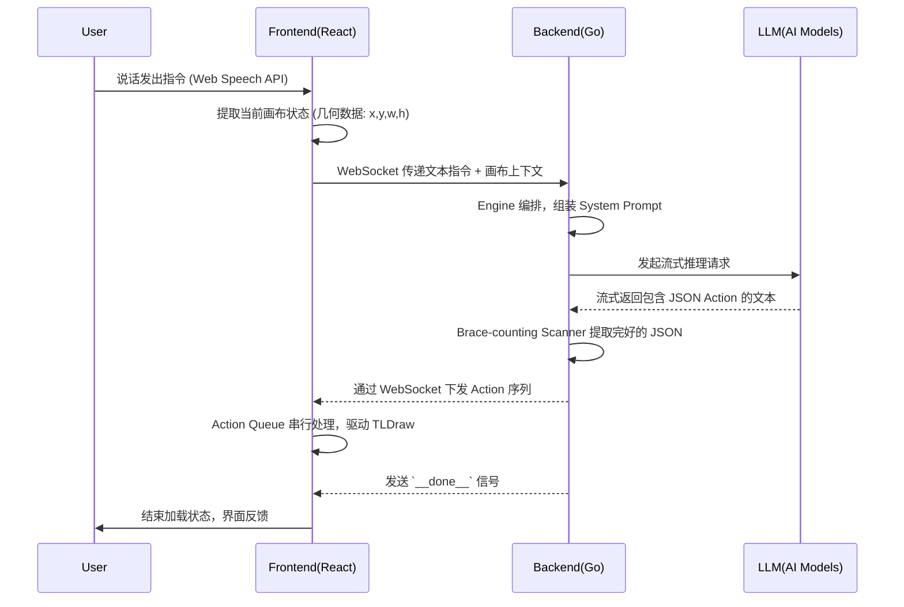

# VoiceCanvas 架构地图 (Architecture Map)

这份地图旨在让未来的开发过程中能够快速回忆起 VoiceCanvas 的核心骨架、数据流和设计约定。

## 1. 核心数据流 (Core Data Flow)

整个系统的运作是一个 **闭环 (Closed Loop)**，从前端采集声音到最终在画布上呈现图形。



## 2. 核心模块划分 (Component Split)

### 2.1 前端 (Frontend)

- **Voice/Audio 层**: `useSpeechRecognition.ts` (基于 Web Speech API)，负责捕捉和实时转录语音。
- **通信与状态层**:
  - `useWebSocket.ts`: 负责 WebSocket 的生命周期，包含**指数退避 (Exponential Backoff)** 的断线重连。
  - `Action Queue Pipeline`: 负责将接收到的并发 Actions 放入队列串行执行，避免状态突变冲突。
- **画布引擎层**: `tldrawInterceptor.ts`，充当 React 与 TLDraw 原生 API 之间的桥梁。负责解析 Action 并转化为 `editor.createShape` 等具体操作。同时收集画布内图形的 `x, y, w, h` 数据供下次请求。
- **UI 组件层**: 严格遵循 Tailwind CSS v4 和 `slate/sky/emerald` 配色。包括 `AIGenerator`（麦克风波纹动效与状态）和 Debug 日志面板。

### 2.2 后端 (Backend)

- **Transport 层**: `ws.go` 负责处理底层的 Gorilla WebSocket 连接，不包含业务逻辑。
- **Orchestrator 层**: `Engine` 模块。将具体连接抽象为 `ClientSession` 接口，隔离网络细节。协调上下文组装、流式解析与下发。
- **解析层 (Parser)**: `Brace-counting Scanner`。核心机制是逐字符扫描 LLM 的流式输出，利用大括号 `{}` 的嵌套层级来精准提取合法的 JSON 对象，避免残缺 JSON 导致的 Crash。
- **LLM/RAG 层**: 负责与外部大模型平台进行交互，调用核心推理大模型解析意图，以及调用多模态视觉模型支持图像理解功能。

## 3. 关键通信契约 (API Contracts)

### 3.1 `__done__` 信号协议

由于 WebSocket 是一种双向全双工协议，前端无法像 HTTP 请求那样知道一个流程的终点。

- **约定**: 后端在单次会话的所有推理完成、或者遭遇致命错误中断时，必须通过 WebSocket 发送 `{ "type": "system", "action": "__done__" }` 信号。
- **作用**: 前端监听此信号，用以解除麦克风锁定、停止加载动画 (Loading Spinner)，宣告当前回合结束。

### 3.2 动作对象 (Action Object) 规范

前端 TLDraw 识别的动作必须严格遵循以下结构（由后端从 LLM 结果中过滤生成）：

```json
{
  "action": "create | update | delete | clear",
  "shapeType": "geo | text | arrow | image",
  "props": {
    "geo": "rectangle | ellipse | triangle",
    "color": "black | blue | red | green | yellow",
    "text": "文字内容"
    // ...以及 x, y 等几何参数（由 LLM 估算或引擎辅助生成）
  }
}
```

## 4. 架构禁忌与红线 (Red Lines)

- **禁止使用 `any`**: 前后端交互数据结构必须定义完整的 TS Interface。
- **禁止前端全局污染**: 所有状态必须通过 Zustand（全局）或 React Hooks（局部）管理，禁止直接挂载到 `window` 上或使用全局变量绕过 React 生命周期。
- **禁止混用 UI 库折叠机制**: 侧边栏折叠必须由 Tailwind 的 `flex-shrink-0` 和动态宽度配合纯 `div` 实现，严禁引入第三方 UI 库自带的 `Sider`，以防布局坍塌。
